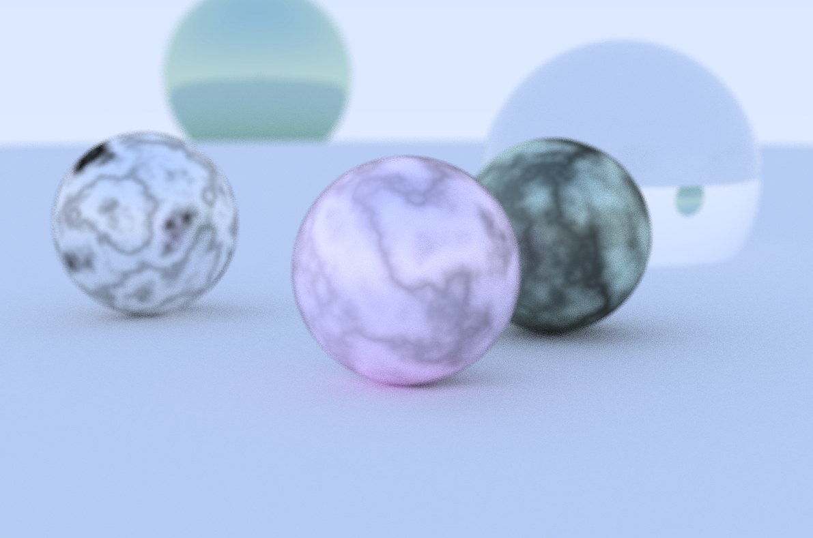

# RayTracing

Project based on the book available in the book [RayTracing in One Weekend](https://raytracing.github.io/) by _Peter Shirley_, and made for the class of Computer Graphics at Insper.

**Professors:** _Luciano Soares_ and _Fabio Orfali_

**Students:** _Lucas Leal_ and _Rafael Almada_

---

The code was implemented in C++, following the book's author step-by-step.

There was a new material made by the students that imitates a marble surface.

And also, the implementation in software, the paraboloid was developed by the students. A preview can be seen below.

